# 신한 해커톤

## 일코해제

## 💡 UCC

## 🚩 목차

1. 기획 배경
2. 서비스 소개
3. 기능 소개
4. 기술 스택
5. 프로젝트 일정 및 기타 산출물
6. 팀원 소개 및 소감

## ✨ 기획 배경

### 개요

-   한 줄 설명 : 원하는 아이돌에 대해 안전한 펀딩 서비스 제공
-   서비스명 : **SOL Star**

### 목적

-   내가 좋아하는 아이돌에 직접 **펀딩**을
-   신한은행과 함께 안전하게 거래하며
-   자신만의 아이돌과 펀딩을 관리
-   주최자의 **공지사항** **홍보글**을 통해 정보 전달까지

### 현 상황

-   아이돌 팬카페 운영자의 실상 ['팬 모금' 1600만원 꿀꺽…아이돌 팬카페 운영자 실형](https://www.newsis.com/view/NISX20230922_0002461358)
-   정확한 증빙자료 없이 한순간에 사라지는 모금액 ['수천만원 모금에 영수증 한 장 없어' 팬심 멍들이는 '총공' 횡령](https://www.hankookilbo.com/News/Read/A2021121010390004582)

## ✨ 기능 소개

**아이돌 팬덤 문화가 커지면서 아티스트와 팬 간 소통도 활발해지고 팬 문화도 많이 발전했습니다. 예시로 아티스트 생일에 팬들이 모금해서 선물을 챙겨주거나, 지하철 전광판에 생일 축하 광고를 하는 경우가 많아졌습니다. 하지만 이에 비해 펀딩 방식은 여전히 발전하지 않고 있습니다.**
기존 펀딩 방식은 주최자가 이벤트를 기획해서 트위터(X)에 올리고, 수요조사를 한 후 구글 폼과 본인 계좌로 모금을 받는 방식이었습니다. 하지만 여기에는 다음과 같은 몇 가지 문제가 있습니다.

1. 신뢰 문제: 트위터(X)의 경우 주최자에 대한 정보가 부족해서 신뢰하기 어렵고, 주최자가 이벤트 상황을 공유하지 않거나 모금액을 들고 사라지는 문제 발생
2. 환불 문제: 이벤트 도중 목표 금액 미달 시 주최자가 일일이 참여자에게 환불을 해줘야 하는 번거로움
3. 소속사와의 소통 문제: 아티스트에게 직접 선물을 보내기 위해 팬카페 글이나 이메일로 소속사의 승인을 받아야 하는 절차상 복잡함
   이런 문제를 해결하기 위해, 믿을 수 있는 은행 플랫폼을 통해 더 안전하게 팬 문화를 즐길 수 있는 ‘쏠·스타’ 를 기획하게 되었습니다. ‘쏠·스타’를 통해 신뢰할 수 있는 새로운 펀딩 문화를 만들어가고자 합니다.

\*[펀딩 종류]
아티스트 직접 전달: 연예인에게 직접 선물을 전달하는 펀딩
아티스트 간접 전달: 지하철 광고나 기부 형태로 연예인에게 간접적으로 전달되는 펀딩

1. 펀딩 생성 및 참여
   • 펀딩 종류, 목표 금액, 기한을 정하여 펀딩을 생성할 수 있습니다.
   • 원하는 펀딩에 참여할 수 있습니다.
2. 소속사 펀딩 인증 제도
   • 직접 전달 펀딩 주최자는 서비스 내 소속사 공식 계정에 이벤트 참여 요청을 보낼 수 있습니다.
   • 소속사의 승인을 받은 펀딩은 인증 배지를 부여받아 펀딩을 진행합니다.
3. 안심할 수 있는 펀딩액 관리
   • 펀딩액은 주최자의 계좌가 아닌 가상계좌에 모이며 목표 금액이 달성되었을 때만 사용할 수 있습니다.
   • 펀딩 참여자는 펀딩 목표 미달시 자동환불 시스템으로 보장받을 수 있습니다.
   • 주최자는 펀딩액 사용 후 정산과정을 통해 증빙합니다.
4. 주최자 리뷰 제도
   • 펀딩이 끝난 후 참여자들은 펀딩 주최자에 대한 리뷰를 남길 수 있습니다.
   • 해당 리뷰들을 바탕으로 정보를 확인할 수 있습니다.
5. 커뮤니티 제공
   • 커뮤니티에서 팬들은 생일 카페 홍보, 포토카드 교환 등 활발한 교류를 할 수 있습니다.

## ✨ 기술 스택

-   **프론트엔드** : React, Redux-toolkit, PWA,
-   **백엔드** : Spring Boot, Spring Security, JWT
-   **인프라** : Nginx, MySQL, Certbot, EC2, maria db, mysql
-   **이슈 관리** : Mattermost, Notion

### 아키텍처 설계도

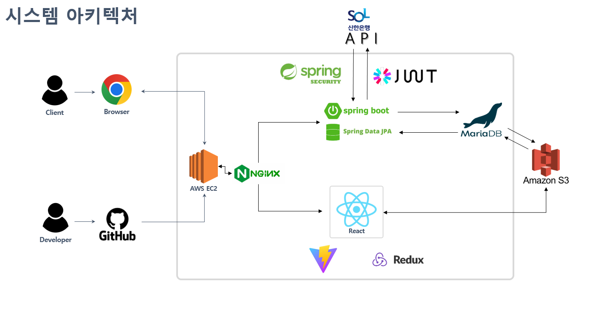

## ✨ 프로젝트 일정 및 기타 산출물

### 프로젝트 일정

**전체 일정** : 2024.07.16 ~ 2024.09.01(총 17일)

-   **기획** : 2024.08.16 ~ 2024.08.29(총 14일)
-   **개발** : 2024.08.30 ~ 2024.09.01(총 3일)

### Git Flow

### 기능명세서

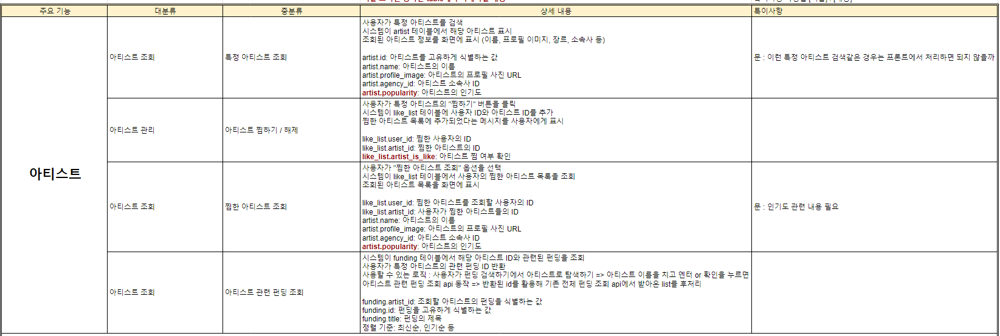
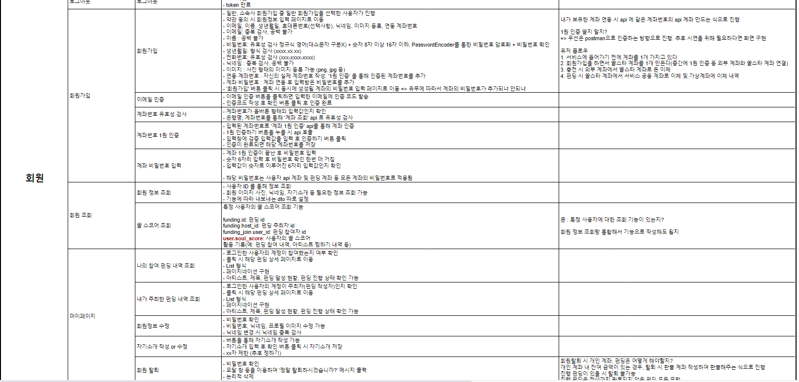

### ERD

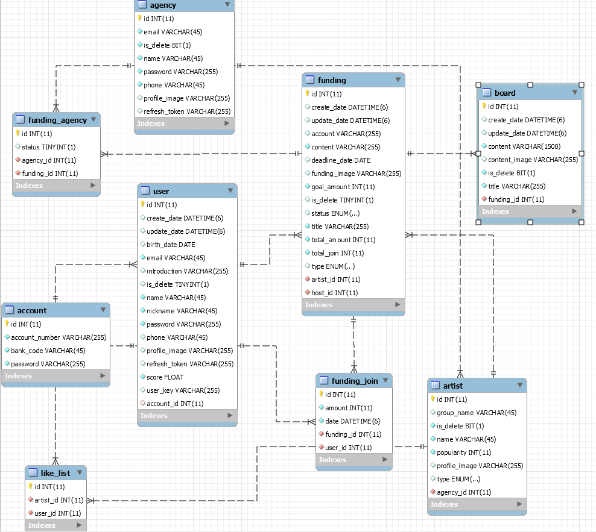

### API 명세서

| [API 명세서](https://past-currant-4d8.notion.site/API-57f2a24c811143dea87f1da52203df55) |                                  |
| :-------------------------------------------------------------------------------------: | :------------------------------: |
|                            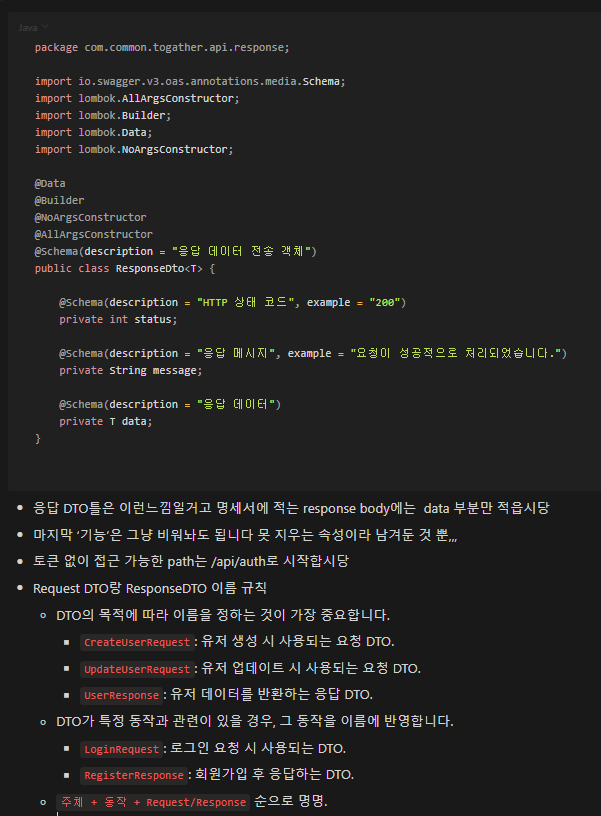                             | 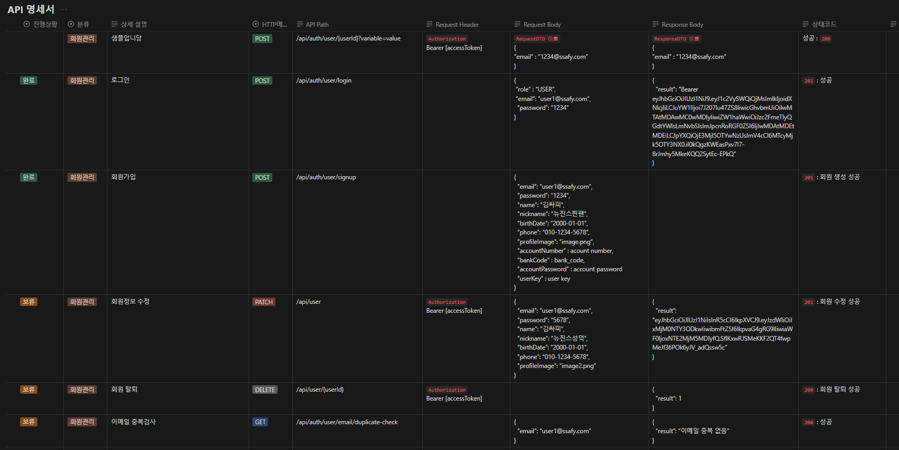 |
|                            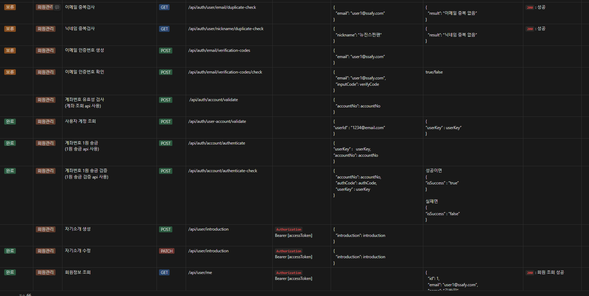                             | 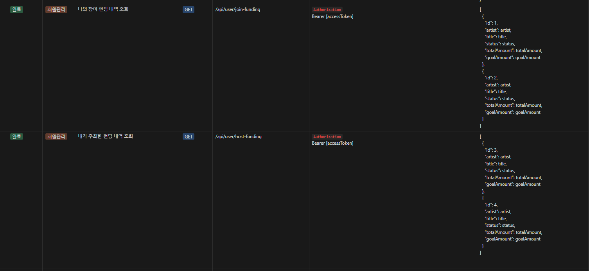 |
|                            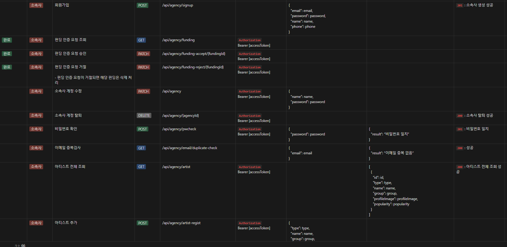                             | 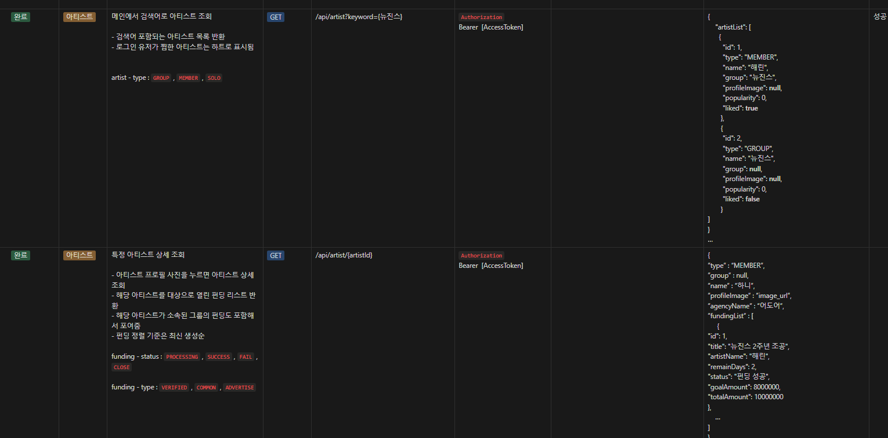 |
|                            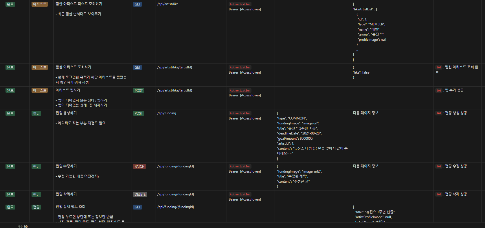                             | 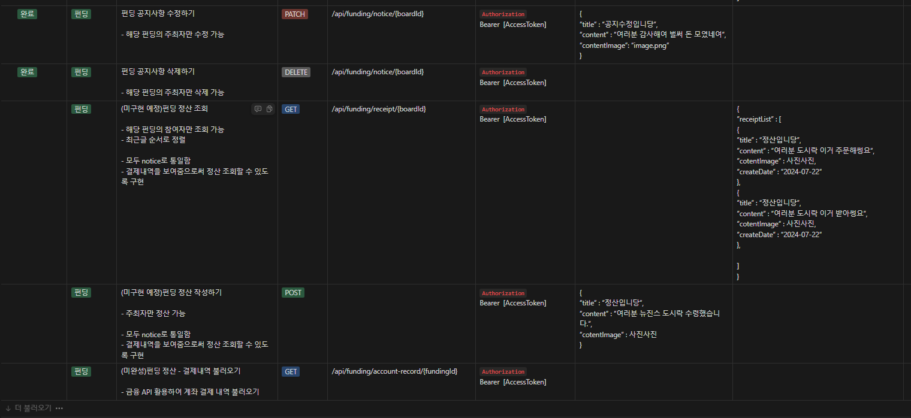 |

## ✨ 화면

|                                                        |                                                 |                                                      |                                                        |
| :----------------------------------------------------: | :---------------------------------------------: | :--------------------------------------------------: | :----------------------------------------------------: |
|          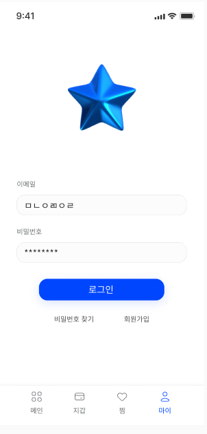          |     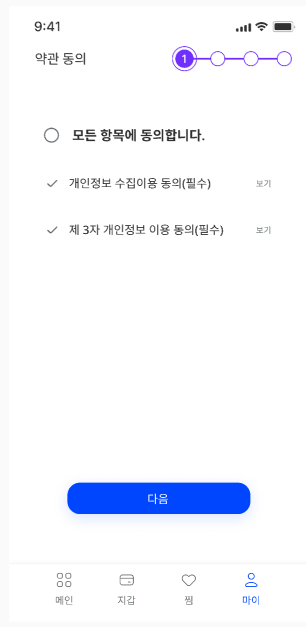      |    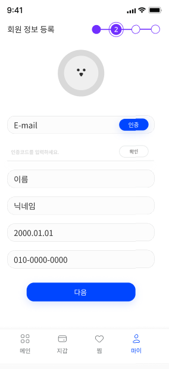     |    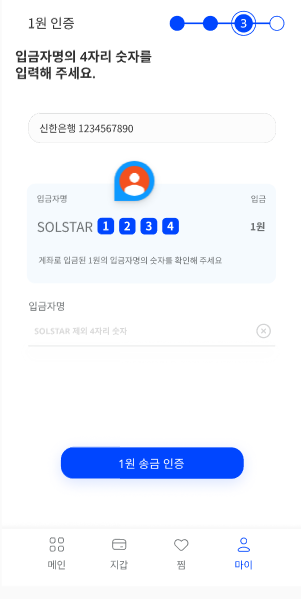     |
|                         로그인                         |                    약관동의                     |                    회원 정보 등록                    |                        1원 인증                        |
|     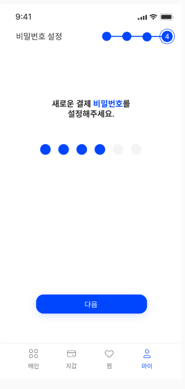     | 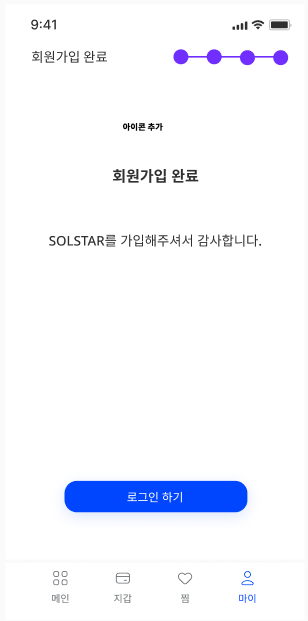 |         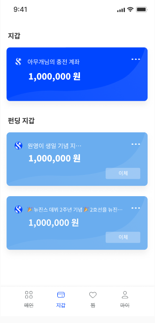          |         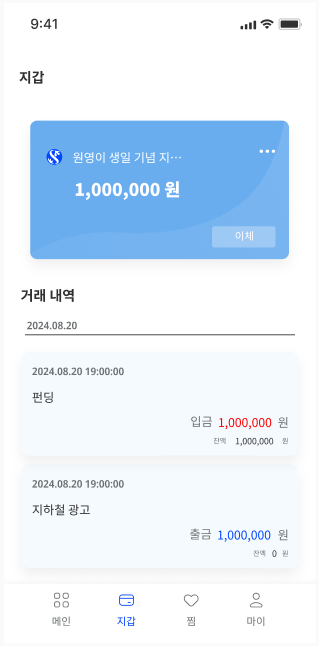          |
|                     비밀 번호 설정                     |                  회원가입 완료                  |                      지갑 기능                       |                       거래 내역                        |
|     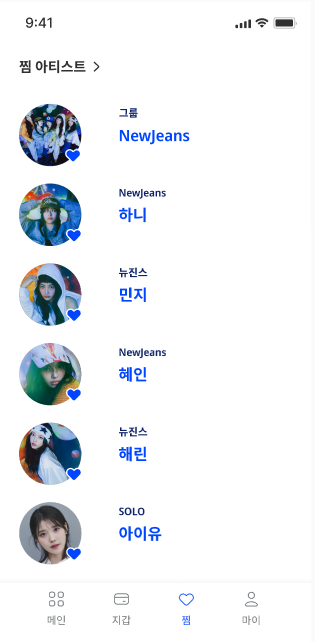     | 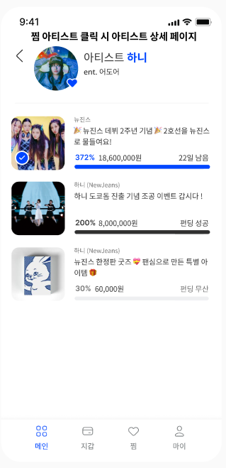 |        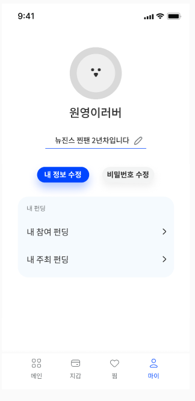        |      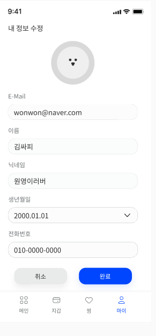       |
|                      찜 아티스트                       |                   펀딩 리스트                   |                     마이 페이지                      |                      내 정보 수정                      |
| 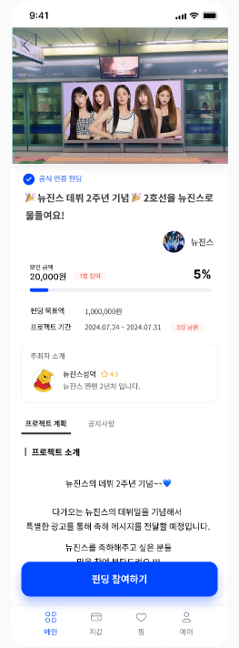 | 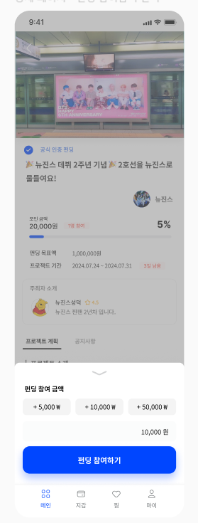 |     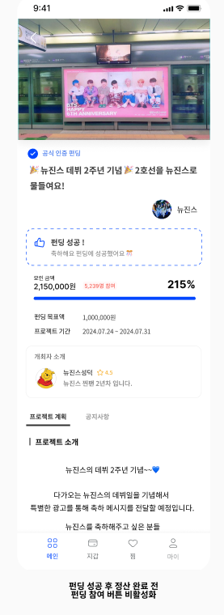     |        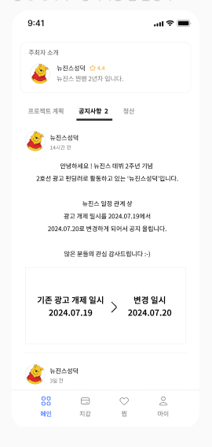         |
|                    펀딩 상세 페이지                    |                    펀딩 참여                    |                     펀딩 성공 시                     |                        공지사항                        |
| 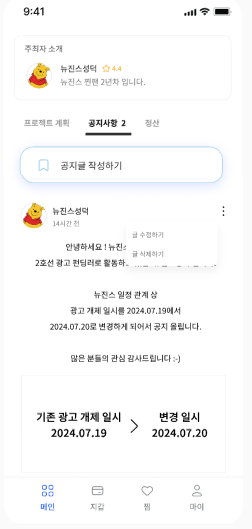  |  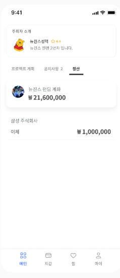   | 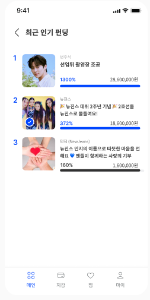 | 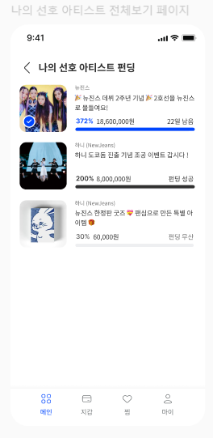 |
|                  펀딩 개최자 공지사항                  |                 정산 탭 활성화                  |                    최근 인기 펀딩                    |                나의 선호 아티스트 펀딩                 |
